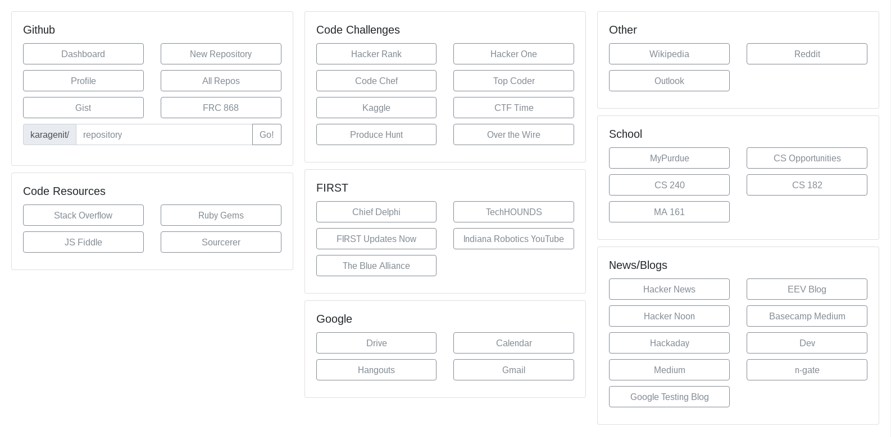

# Homepage

Dynamically Generating New Tab Pages with JSON in React

## Setup & Usage

First, clone this repository. Most files are in `src/`.

To configure, you must edit `src/data.json` with the links etc. that you want in your homepage. Then, run `yarn build` to build a static site (located in `build/`), and then set this as your browser's homepage. 

> **NOTE:** you will have to edit the `homepage:` value in `package.json` to reflect the directory that the built files will be stored in.
